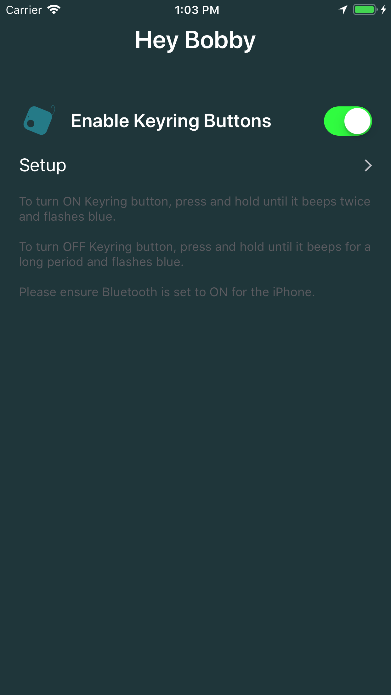

# Hey Bobby

Hey Bobby is a simple notification app for getting the attention of someone using a Bluetooth keyring button.

Setup the app on your phone and provide a Bluetooth LE keyring button to someone who needs to get your attention.

When the button is clicked, if the app is open, you'll see an alert. If the app is in the background, you'll receive a push notification, which when tapped opens the alert.

There are 3 click levels that correspond to alert severity:

* 1 click - green (non-urgent)
* 2 clicks - amber (urgent)
* 3 clicks - red (emergency)

This app was designed and developed for a participant on the BBC2 show Big Life Fix.

Currently supported Bluetooth LE Keyring buttons:

http://amzn.eu/8njRlaq

## Requirements

* [Xcode](https://developer.apple.com/xcode/download/)
* [Cocoapods](https://cocoapods.org/)

## Screenshots

Dashboard                      |  Custom Messages
:-------------------------:|:-------------------------:
 | 

Non-urgent                      |  Urgent
:-------------------------:|:-------------------------:
 | 

Emergency
:-------------------------:|
 |

## Installation Instructions

1. Download the [source code](https://github.com/akramhussein/hey-bobby)

  `$ git clone git@github.com:akramhussein/hey-bobby.git`

2. Install [cocoapods](https://cocoapods.org/)

  `$ cd ./hey-bobby && pod install`

3. Open "Hey Bobby.xcworkspace" in Xcode

4. Open Xcode's Preferences > Accounts and add your Apple ID

5. In Xcode's sidebar select "Hey Bobby" and go to Targets > Hey Bobby > General > Identity and add a word to the end of the Bundle Identifier to make it unique. Also select your Apple ID in Signing > Team

6. Connect your iPad or iPhone and select it in Xcode's Product menu > Destination

7. Press CMD+R or Product > Run to install `1Hey Bobby`

## License

hey-bobby is available under the GPLv3 License.
